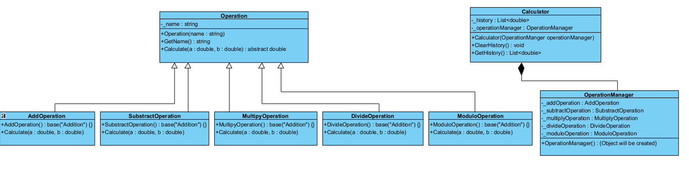

# Basic Calculator Application

**Author:** Tyrone Martin, students in CSE 210.

## Overview

This project was created as part of my final project assessment. I had developed a basic calculator application to demonstrate the principles taught within this course for object-oriented programming, in C#. These principles include, but are not limited to, inheritance, encapsulation, and polymorphism. Below you find the UML design that was used for this project, along with other startup details and information that are relevant to project.



## Features

This project is a simple calculator application that performs basic arithmetic operations. It features a user-friendly interface that allows users to enter numbers and select an operation, and then the calculator displays the result of the operation. The application also provides a history of previous calculations, which is stored in a list of `CalculationRecord` objects for the current session. The application also allows users to reset the calculator by clearing the history, and exiting the application by selecting the "Quit" option.

## Project Structure

The project is structured as follows:

- `Program.cs`: The main entry point of the application.
- `Operation`: Contains the `abstract base class Operation`, which defines the common behavior of all main operations.
- `CalculatorHelper.cs`: Contains the `CalculatorHelper` class, which helps perform the main function by keeping track of the user's input and history, and determine the operation that will be executed based on the user's input.
- `Calculator.cs`: Contains the `Calculator` class, which tracks and carries out the main function of the calculator.
- `CalculationRecord.cs`: Contains the `CalculationRecord` class, which holds the details of a single calculation performed by the calculator.
- `AdditionOperation.cs`: Contains the `AdditionOperation` subclass, which performs the addition operation.
- `SubtractionOperation.cs`: Contains the `SubtractionOperation` subclass, which performs the subtraction operation.
- `MultiplicationOperation.cs`: Contains the `MultiplicationOperation` subclass, which performs the multiplication operation.
- `DivisionOperation.cs`: Contains the `DivisionOperation` subclass, which performs the division operation.
- `ModuloOperation.cs`: Contains the `ModuloOperation` subclass, which performs the modulo operation.

## How to Use

1. Open the project in your preferred IDE (e.g., Visual Studio Code).
2. Download or clone this repository from GitHub [here](https://github.com/TyroneMartin/cse210-projects.git).
3. Download the .NET SDK if you haven't already done so.
4. Open the project in Visual Studio Code.
5. Open terminal and navigate to the project folder `CTRL +  ~ ` for Windows.
6. Import or clone the repository into Visual Studio Code.
7. Open the `Program.cs` file for the final project program.
8. Run the program by selecting "Debug" from the menu.
9. The calculator will display a welcome message. Select an option from the menu.
10. Enter the first number, select an operation, and enter the second number.
11. The calculator will display the result.
12. Return to the main menu to perform additional operations.
13. Select "Quit" to exit the program.

## Creating a New Project

To create a new project, follow these steps:

1. Open your preferred IDE (e.g., Visual Studio Code).
2. Download the .NET SDK if you haven't already done so.
3. Open the project in Visual Studio Code.
4. Open terminal and navigate to the project folder `CTRL +  ~ ` for Windows.
5. Import/clone or create a new project to the repository in Visual Studio Code.
6. Run the `dotnet new console` command to create a new project C# project.

- Build the project by running the `dotnet build` command. [**_Additional help below_**](#additional-help)

6. Open the `Program.cs` file for the final project program.

- Run the program by pressing F5 or selecting "Debug" from the menu.

## Additional help for installation

### Compiling on Your Local Machine

## Additional Help

Follow these steps to compile the project using the .NET SDK:

1. **Install .NET SDK (if not already installed):**

   - Download and install the .NET SDK from the official website: [Download .NET SDK](https://dotnet.microsoft.com/download).

2. **Navigate to the Project Folder:**
   Open your terminal or command prompt and navigate to the folder containing your project files (e.g., `Learning05`).

   ```bash
   cd path/to/your/project/Learning05
   ```

3. **Compile the Project:**
   Use the following command to build the project:

   ```bash
   dotnet build OR dotnet new console

   ```

4. **Run the Program:**
   If the build is successful, you can run the program with:

   ```bash
   dotnet run
   ```

## System Requirements

- **Operating System:** Windows, macOS, or Linux
- **IDE:** Visual Studio Code
- **.NET SDK:** [Download .NET SDK](https://dotnet.microsoft.com/download)

## Future Improvements

- Add unit tests
- Add more operations
- Add more features
  - Such as a better UI
  - History of previous calculations
- Add more documentation
- Add more comments
