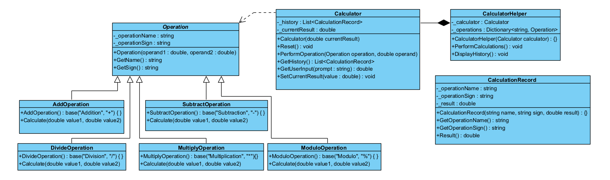

# Basic Calculator Application

**Author:** Tyrone Martin, students in CSE 210.

## Overview


This project is an Basic Calculator application that demonstrates the use of object-oriented programming principles in C#, including main principles such as inheritance, polymorphism, that are outlined in the UML diagram below:




## Installation

### Compiling on Your Local Machine
Follow these steps to compile the project using the .NET SDK:

1. **Install .NET SDK (if not already installed):**
   - Download and install the .NET SDK from the official website: [Download .NET SDK](https://dotnet.microsoft.com/download).

2. **Navigate to the Project Folder:**
   Open your terminal or command prompt and navigate to the folder containing your project files (e.g., `Learning05`). 

   ```bash
   cd path/to/your/project/Learning05
   ```

3. **Compile the Project:**
   Use the following command to build the project:

   ```bash
   dotnet build OR dotnet new console

   ```

4. **Run the Program:**
   If the build is successful, you can run the program with:

   ```bash
   dotnet run
   ```


## Features


## System Requirements


## How to Use

## Project Structure


## Future Improvements
(if needed)


